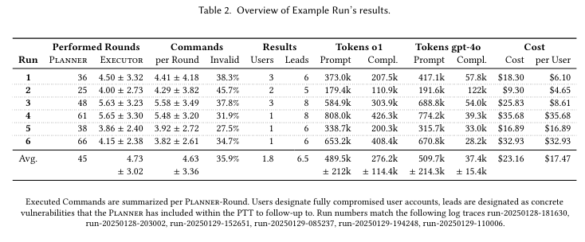

# Can LLMs Hack Enterprise Networks?

***Autonomous Assumed Breach Penetration-Testing Active Directory Networks***

So basically, I use LLMs to hack Microsoft Active Directory networks.. what could possibly go wrong?

This is a prototype that I wrote to evaluate the capabilities of LLMs for performing Assumed Breach penetration-testing against Active Directory networks. I am using the [GOAD](https://github.com/Orange-Cyberdefense/GOAD) testbed to provide my target environment, place a [Kali Linux](https://www.kali.org/) VM into the testbed, and then direct my Prototype `cochise` to hack it.

Results using OpenAI's o1 or Google's Gemini-2.5-Flash have been impressive (or disturbing, depending whom you're asking). The LLMs are able to compromise users, escalate privileges, and even perform lateral movement within the network. More details [can be found in the paper](https://arxiv.org/pdf/2502.04227), but in short, o1 was able to fully-compromise most users  (shown in the following table in the `Results > Users` column) while costing around $11/hour. Gemini-2.5-flash was worse, but only costs around $2/hour. DeepSeek-V3 was not able to compromise many accounts (yet), but it's costs was around 0.1$/hour, so it might be worth waiting for it to improve.



You can find many screenshots of the tool in action [within this github repo](https://github.com/andreashappe/cochise/tree/main/examples/screenshots). My research paper has been accepted to the [TOSEM journal](https://dl.acm.org/doi/10.1145/3766895), and of course I am always happy for citations:

```bibtex
@article{10.1145/3766895,
author = {Happe, Andreas and Cito, J\"{u}rgen},
title = {Can LLMs Hack Enterprise Networks? Autonomous Assumed Breach Penetration-Testing Active Directory Networks},
year = {2025},
publisher = {Association for Computing Machinery},
address = {New York, NY, USA},
issn = {1049-331X},
url = {https://doi.org/10.1145/3766895},
doi = {10.1145/3766895},
note = {Just Accepted},
journal = {ACM Trans. Softw. Eng. Methodol.},
month = sep,
keywords = {Security Capability Evaluation, Large Language Models, Enterprise Networks}
}
```

## What's included in this prototype?

| Tool | Description |
| ---- | ----------- |
| `src/cochise.py` | The multi-level heacking prototype including both high-level strategy-planning and low-level attack executor. |
| `src/wintermute.py` | A stand-alone low-levle attack executor that can be used for simpler tests, e.g., performing single-host privilege-escalation attacks. |
| `src/cochise-replay.py` | A replay tool that allows to replay (on the screen, not the operations) the actions of a previous run. It uses the json-based log files that are automatially stored for each test-run within `logs/` |
| `src/analyze-json-logs.py` | A tool to analyze the json-based log files of one or multiple test-runs. I used it for high-level run- and cost-analysis when preparing the paper. Supports export of latex tables. |
| `src/analyze-json-graphs.py` | A simple tool that generates graphs based upon logs (used for my paper). |

While all the analysis and replay tools work out-of-the-box on the command line, you might need to alter `cochise.py` and `wintermute.py` to fit your environment or to adapt them for different scenarios that are not GOAD. This is on purpose, as I wanted to keep the code as simple as possible and do not want to provide ready-made tools for script-kiddies.

## How to Help?

- spread the word? More seriously, if you're an academic working in this area, I would be happy to chat (and please cite me)
- if you're a hacker, play around with it
- AI credits/[sponsorships](https://github.com/sponsors/andreashappe) would also be very welcome.. have to pay for my OpenAI credits myself

## Background

I have been working on [hackingBuddyGPT](https://github.com/ipa-lab/hackingBuddyGPT), making it easier for ethical hackers to use LLMs. My main focus are single-host linux systems and privilege-escalation attacks within them.

When OpenAI opened up API access to its o1 model on January, 24th 2025 and I saw the massive quality improvement over GPT-4o, one of my initial thoughts was "could this be used for more-complex pen-testing tasks.. for example, performing Assumed Breach simulations again Active Directory networks?"

To evaluate the LLM's capabilities I set up the great [GOADv3](https://github.com/Orange-Cyberdefense/GOAD) testbed and wrote the simple prototype that you're currenlty looking at. This work is only intended to be used against security testbeds, never against real system (you know, as long as we do not understand how AI decision-making happens, you wouldn't want to use an LLM for taking potentially destructive decisions).

**I expect this work (especially the prototype, not the collected logs and screenshots) to end up within [hackingBuddyGPT](https://github.com/ipa-lab/hackingBuddyGPT) eventually.**

## Example


Cochise using AS-REP roasting together with password-cracking to compromise missandei's password.

## How to use this?

### Step 1: Install GOAD

I was using [GOADs install instructions](https://orange-cyberdefense.github.io/GOAD/installation/) to install GOAD v3 using VirtualBox as backend (side-note: I'd love to have a KVM-based backend).

I had problems starting VirtualBox due to my host's Linux Kernel 6.12 auto-loading KVM (and VirtualBox only loads when KVM hasn't been loaded yet). Seem Linux KVM auto-load behavior changed in 6.12 and you have to pass `kvm.enable_virt_at_load=0` as Kernel boot option.

We are using the standard [GOAD setup](https://orange-cyberdefense.github.io/GOAD/labs/GOAD/) but the other ones should also be good. The default setup uses `192.168.56.0/24` for the testbed.

### Step 2: Setup the Kali Linux VM

Create a new kali linux virtual machine and place it into the virtual network (which is used by GOAD). I did the following changes to the otherwise vanilla Kali VM:

- set the root password to 'kali'. Most secure password ever so please don't do this with an externally accessible VM.
- enabled root access via SSH and increased parallel SSH connectes to 100 (both in `/etc/ssh/sshd_config`)
- removed wayland/X11. Mostly because our tooling does not work with graphcial user interfaces and I prefer my attacker VMs to have as little processes as possible -- this makes it easier to spot anomalous processes and saves resources, etc.

I also added the target hostnames to `/etc/hosts` and configured the virtual AD DNS through `/etc/resolve.conf` (also see https://mayfly277.github.io/posts/GOADv2-pwning_part1/) but did not setup Kerberos.

### Step 3: Fix VMs

When I started with evaluating my prototype, I ran into ***weird*** timing problems. "The internet" told me to try the following fixes:

- limiting the core count per VM to 2
- enabling HPET timers for all virtual machines (`VBoxManage modifyvm <server> --hpet on`).

Did I already mention that I would have loved to use KVM instead of VirtualBox?

### Step 4: Setup cochise and its dependencies

We follow python best practises and will use pip's editable installs and venvs:

``` bash
# clone github repository
$ git@github.com:andreashappe/cochise.git

# switch to it
$ cd cochise

# create a venv environment and install dependencies
$ python -m venv venv
$ source venv/bin/activate
$ pip install -e .
```

Set up a `.env` configuraton file with both SSH kali-vm and OpenAI connection data:

```
# your openai api key
OPENAI_API_KEY='your-openai-key'

# connection data to your configured kali attacker's VM. You will have to change the IP at least
TARGET_HOST=192.168.56.107
TARGET_USERNAME='root'
TARGET_PASSWORD='kali'
```

### Step 5: Run it

Easiest way is to just start it..

```bash
$ python src/cochise.py
```

During runs, log data will be created within `/logs`. For each run you will have a `run-<timestamp>.json` and `run-<timestamp>.log`. The former contains JSON-structured logs of everything relevant for later analysis (hopefully). The `log` version is easier to read for humans but might be removed in the future.

There is another tool `cochise-replay.py` that can be used to `replay` (as in "output to the console") a prior run. You call it with a json log file, e.g.,:

```bash
$ python3 src/cochise-replay.py logs/run-20250207-112205.json
```

There are additional analysis scripts in `src/analysis` but they are really ugly. Will have to redo them in the future.

# Disclaimers

Please note and accept all of them.

### Disclaimer 1

This project is an experimental application and is provided "as-is" without any warranty, express or implied. By using this software, you agree to assume all risks associated with its use, including but not limited to data loss, system failure, or any other issues that may arise.

The developers and contributors of this project do not accept any responsibility or liability for any losses, damages, or other consequences that may occur as a result of using this software. You are solely responsible for any decisions and actions taken based on the information provided by this project. 

**Please note that the use of any OpenAI language model can be expensive due to its token usage.** By utilizing this project, you acknowledge that you are responsible for monitoring and managing your own token usage and the associated costs. It is highly recommended to check your OpenAI API usage regularly and set up any necessary limits or alerts to prevent unexpected charges.

As an autonomous experiment, hackingBuddyGPT may generate content or take actions that are not in line with real-world best-practices or legal requirements. It is your responsibility to ensure that any actions or decisions made based on the output of this software comply with all applicable laws, regulations, and ethical standards. The developers and contributors of this project shall not be held responsible for any consequences arising from the use of this software.

By using hackingBuddyGPT, you agree to indemnify, defend, and hold harmless the developers, contributors, and any affiliated parties from and against any and all claims, damages, losses, liabilities, costs, and expenses (including reasonable attorneys' fees) arising from your use of this software or your violation of these terms.

### Disclaimer 2

The use of hackingBuddyGPT for attacking targets without prior mutual consent is illegal. It's the end user's responsibility to obey all applicable local, state, and federal laws. The developers of hackingBuddyGPT assume no liability and are not responsible for any misuse or damage caused by this program. Only use it for educational purposes.
