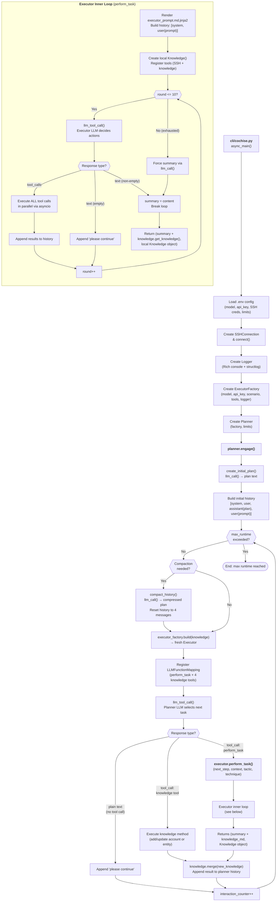

# Cochise: Code Walkthrough

Cochise is an autonomous penetration testing framework that uses LLM-driven hierarchical planning and episodic task execution to attack target networks via SSH. It follows a planner/executor architecture where a high-level planner selects tasks from a tree-structured plan and delegates them to short-lived executor instances that run shell commands on the target.

## Table of Contents

1. [Entry Point: `cli/cochise.py`](#1-entry-point)
2. [Planner: `planner.py`](#2-planner)
3. [Executor: `executor.py`](#3-executor)
4. [Knowledge Base: `knowledge.py`](#4-knowledge-base)
5. [LLM Interface: `common.py`](#5-llm-interface)
6. [SSH Connection: `ssh_connection.py`](#6-ssh-connection)
7. [Logging: `logger.py`](#7-logging)
8. [Templates](#8-templates)
9. [Control Flow Diagram](#9-control-flow-diagram)

---

## 1. Entry Point

**File:** `src/cochise/cli/cochise.py`

The `async_main()` function is the single entry point. It performs setup in a strict sequence:

1. **Load configuration** from `.env` via `dotenv` and read environment variables (`LITELLM_MODEL`, `LITELLM_API_KEY`, `TARGET_HOST`, etc.).
2. **Create SSH connection** (`get_ssh_connection_from_env()`) and connect to the target.
3. **Initialize logger** with a `Rich` console for pretty output and `structlog` for JSON log files under `logs/`.
4. **Build components:** An `ExecutorFactory` is created with the model, API key, scenario text, the SSH `execute_command` tool, and the logger. A `Planner` is created with the factory and configuration limits (max runtime, max context size, max interactions).
5. **Start the run** by calling `planner.engage()`.

The scenario text is loaded at import time from `templates/scenario.md` and describes the penetration test objective (Active Directory domain dominance on 192.168.122.0/24).

---

## 2. Planner

**File:** `src/cochise/planner.py`

The Planner is the strategic brain. It maintains a conversation history with the LLM, a Knowledge base, and a hierarchical task plan. Its lifecycle:

### 2.1 Initial Plan Creation (`create_initial_plan`)

- Renders the `ptt_update.md.jinja2` template with an empty plan and no prior results.
- Calls `llm_call()` (a simple LLM completion, no tools) asking the LLM to produce a tree-structured task plan.
- Returns the plan text.

### 2.2 Main Loop (`engage`)

Sets up the initial conversation history as four messages:
1. **System:** scenario + plan structure rules (`planner_ptt.md`)
2. **User:** "Create me an initial plan..."
3. **Assistant:** the generated plan (from step 2.1)
4. **User:** the selection prompt (`planner_prompt.md`) asking which task to execute next

Then enters the main loop (bounded by `max_runtime`):

**Each round:**

1. **Check compaction triggers:** If `max_interactions` exceeded or `last_input_tokens >= max_context_size`, call `compact_history()` to summarize and reset the conversation.
2. **Build a fresh Executor** via `executor_factory.build(self.knowledge)`. Each executor starts with no memory of previous rounds but receives the current knowledge base.
3. **Register tools** as an `LLMFunctionMapping`:
   - `executor.perform_task` -- delegate a subtask to the executor
   - `knowledge.add_compromised_account` -- store a found credential
   - `knowledge.update_compromised_account` -- update an existing credential
   - `knowledge.add_entity_information` -- store recon findings
   - `knowledge.update_entity_information` -- update recon findings
4. **Call LLM** with `llm_tool_call()`, passing the history and tool definitions. The LLM selects a task and calls the appropriate tool.
5. **Process tool calls:** For each tool call in the response:
   - Execute the function (e.g., `executor.perform_task(...)` which runs the full executor loop).
   - If the result is a tuple `(summary, knowledge)` (from the executor), merge the returned knowledge into the planner's knowledge and log it.
   - Append the tool result to the conversation history.
6. **Handle non-tool responses:** If the LLM responds with text instead of a tool call, append a "please continue" user message and retry.
7. **Increment interaction counter** and loop.

### 2.3 History Compaction (`compact_history`)

When the conversation grows too large:
1. Appends a user message asking the LLM to produce an updated hierarchical plan.
2. Calls `llm_call()` to get the compressed plan.
3. Replaces the entire history with a fresh four-message sequence (system, user request, assistant plan + current knowledge, user selection prompt).

This keeps the context window bounded while preserving strategic state.

---

## 3. Executor

**File:** `src/cochise/executor.py`

The Executor handles low-level task execution. It is ephemeral: created fresh for each planner round, destroyed after.

### 3.1 Factory (`ExecutorFactory`)

Stores shared configuration (model, API key, scenario, tools, logger). `build(system_knowledge)` creates a new `Executor` instance pre-loaded with the current knowledge snapshot.

### 3.2 Task Execution (`perform_task`)

Parameters received from the planner: `next_step`, `next_step_context`, `mitre_attack_tactic`, `mitre_attack_technique`.

**Setup:**
1. Renders `executor_prompt.md.jinja2` with the task details and current knowledge.
2. Creates a two-message history: system (scenario) + user (rendered prompt).
3. Creates a **local** `Knowledge()` instance (separate from the planner's).
4. Registers tools: all configured tools (SSH `execute_command`) plus the four knowledge mutation methods on the local knowledge.

**Execution loop** (up to `MAX_ROUNDS=10`):
1. Call `llm_tool_call()` with the executor's local history.
2. If the response contains tool calls:
   - Execute **all tool calls in parallel** using `asyncio.create_task()` and `asyncio.as_completed()`. This is key for performance when running multiple SSH commands.
   - Collect results and append each as a tool message to history.
   - Display progress bars via `Rich`.
3. If the response is plain text (no tool calls):
   - Non-empty content = the task summary. **Break** the loop.
   - Empty content = append "please continue" and retry.
4. After `MAX_ROUNDS` without a summary, force one by appending a user message and calling `llm_call()`.

**Returns** a tuple: `(summary_text + knowledge_markdown, local_knowledge_object)`. The planner uses both the text (appended to history) and the knowledge object (merged into its own).

---

## 4. Knowledge Base

**File:** `src/cochise/knowledge.py`

A simple in-memory store with two dictionaries and an auto-incrementing counter:

- **`compromised_accounts`**: keyed by ID, stores `{username, password, context, dirty}`.
- **`entity_information`**: keyed by ID, stores `{entity, information, dirty}`.

### Key Operations

| Method | Called by | Purpose |
|--------|-----------|---------|
| `add_compromised_account` | LLM (planner or executor) via tool call | Store a new credential |
| `update_compromised_account` | LLM via tool call | Update an existing credential entry |
| `add_entity_information` | LLM via tool call | Store recon info (hosts, services, vulns) |
| `update_entity_information` | LLM via tool call | Update existing recon info |
| `merge(other)` | Planner, after executor returns | Copy dirty entries from executor's local knowledge into the planner's global knowledge |
| `get_knowledge()` | Planner/Executor prompts | Render all knowledge as markdown tables for LLM context |

### Dirty Flag Mechanism

The `dirty` flag tracks which entries are new or modified. When an executor adds findings, they are marked `dirty=True`. On `merge()`, only dirty entries are copied into the parent knowledge and then marked `dirty=False`. This prevents re-merging already-known information.

---

## 5. LLM Interface

**File:** `src/cochise/common.py`

Provides a thin wrapper around `litellm` for unified LLM access:

### `LLMFunctionMapping`

Converts Python callables into LLM tool definitions using `litellm.utils.function_to_dict()`. Maintains a name-to-function mapping for dispatch.

### `llm_tool_call(model, api_key, tools, messages)`

Used by both planner and executor for the main reasoning loops. Calls `litellm.completion()` with tool definitions. Returns `(response_message, costs_dict, duration_seconds)`.

### `llm_call(model, api_key, messages)`

Used for simple completions without tools (initial plan creation, history compaction, forced executor summaries). Returns `(content_dict, duration, costs)` where `content_dict` contains `content` and `reasoning_content` fields.

### Helpers

- `message_to_json()` -- serializes LLM response messages (including tool calls) for history storage.
- `is_tool_call()` -- checks if a response contains tool calls.
- `get_or_fail()` -- reads a required environment variable or raises.
- `convert_costs_to_json()` -- converts the litellm usage object to a plain dict.

---

## 6. SSH Connection

**File:** `src/cochise/ssh_connection.py`

A dataclass wrapping `asyncssh` for command execution on the target:

- `connect()` -- establishes the SSH connection.
- `execute_command(command, mitre_attack_technique, mitre_attack_procedure)` -- the LLM-callable tool. Runs a command via SSH, handles timeouts (600s default) and channel errors with automatic reconnection. Returns stdout as a string.
- `get_ssh_connection_from_env()` -- factory reading `TARGET_HOST`, `TARGET_USERNAME`, `TARGET_PASSWORD` from environment.

---

## 7. Logging

**File:** `src/cochise/logger.py`

Dual-output logging:
- **Console:** `Rich` panels and pretty-printing for real-time monitoring.
- **File:** `structlog` JSON lines to `logs/run-{timestamp}.json` for replay and analysis.

Log event types: `log_data`, `log_llm_call` (with costs/duration), `log_tool_call` (with params), `log_tool_result`, `log_append_to_history`. Sub-agent identity tracking via the `identity` field (main planner vs executor tool_call_id).

---

## 8. Templates

| Template | Used by | Purpose |
|----------|---------|---------|
| `scenario.md` | Entry point | Defines the pentest objective, rules, and tool guidance |
| `planner_ptt.md` | Planner (system prompt, compaction) | Rules for tree-structured task plan maintenance |
| `planner_prompt.md` | Planner (user prompt each round) | Instructions to select the next task |
| `ptt_update.md.jinja2` | Planner (`create_initial_plan`, `compact_history`) | Template for plan generation with Jinja2 variables |
| `executor_prompt.md.jinja2` | Executor (`perform_task`) | Task prompt with step details, context, and knowledge |

---

## 9. Control Flow Diagram

This diagram shows how `cli/cochise.py` (the entry point), the `Planner`, and the `Executor` interact at runtime. The planner runs a persistent loop, building a fresh executor each round and delegating one task at a time. The executor runs its own inner loop of LLM reasoning and SSH command execution, then returns results to the planner.

---